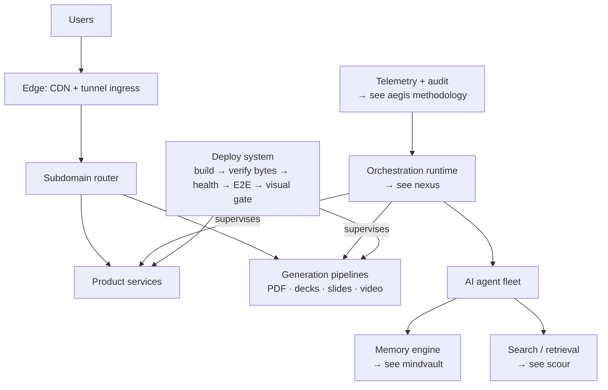

# The Estate

**130+ production services. One engineer. This repo is the map.**

I design, build, and operate a full production software estate solo — AI products, media
generation pipelines, orchestration infrastructure, and the machinery that keeps it all alive.
Everything below is deployed, monitored, and serving real users right now.

🔗 **Case studies, live demos, and engagement details: [ark.chakrakali.com](https://ark.chakrakali.com)**

---

## By the numbers

| Metric | Value | How it's kept honest |
|---|---|---|
| Production services | **130+** | live estate inventory, refreshed every 6h |
| Uptime (supervised fleet) | **99.97%** | evidence-based liveness — no timeout guesswork |
| Stall recovery | **~3 s** | automatic, streamed to an ops cockpit |
| AI memory store | **158,000+ memories** | 100% embedding coverage, 48K knowledge-graph edges |
| Frontend quality gate | **Lighthouse 100** | deploys are blocked below it — a ratchet, not a goal |
| Products launched | **14** (2026-07-04, one day) | each with payments, auth, and E2E gates |

## What this buys you

If you're a founder or an owner, the numbers above translate simply: **software that ships in
days instead of quarters, stays up without a team babysitting it, and gets cheaper to run over
time instead of more expensive.** The whole estate exists to prove one thing — AI-operated
engineering, held to production discipline, lets one person deliver what used to take a
department. Your project inherits that machinery from day one.

## What's live (selection)

| Product | What it does |
|---|---|
| **DocForge** | Pixel-accurate PDF & PowerPoint generation as an API |
| **DeepLens** | Federated search across 40+ sources |
| **Warden** | Smart scheduling with embeddable booking flows |
| **StudyMagic** | AI-driven spaced-repetition learning platform |
| **Isekai Engine** | AI narrative RPG with persistent world state |
| **HTML deck generator** | Animated presentation decks from a prompt |
| **Programmatic video** | Scripted, voiced, rendered video — fan-out cloud rendering |
| **Workflow Master** | AI business-workflow engine |

Full catalog with case studies → [ark.chakrakali.com](https://ark.chakrakali.com)

## How one person runs this

The honest answer: **agents do the labor, architecture does the discipline.** A supervised AI
agent fleet handles implementation under hard gates — tests, byte-verified deploys, Lighthouse
ratchets, visual verification against production. The interesting engineering is the gates.

## Engineering doctrine

- **The diff is the proof.** Claims ship with benchmarks and before/after numbers, or they're marked pending.
- **Debug the root cause.** Workarounds are debt with interest.
- **No silent failures.** Detect → confirm → recover → escalate loudly. Liveness by evidence, never by timeout.
- **Quality is a ratchet.** Gates only tighten. A deploy that would lower the bar doesn't deploy.

## Where's the source?

Product source is **private** — these are commercial systems with paying users. What's open:

- [**scour**](https://github.com/SA-Ark/scour) — the retrieval primitives, full source, zero deps
- [**aegis**](https://github.com/SA-Ark/aegis) — the production-audit CLI, full source
- [**nexus**](https://github.com/SA-Ark/nexus) / [**mindvault**](https://github.com/SA-Ark/mindvault) — architecture showcases with live demos

Happy to walk through any private codebase live in an interview or scoping call.

---

**Building something?** I take a small number of fixed-price engagements →
[ark.chakrakali.com](https://ark.chakrakali.com)
