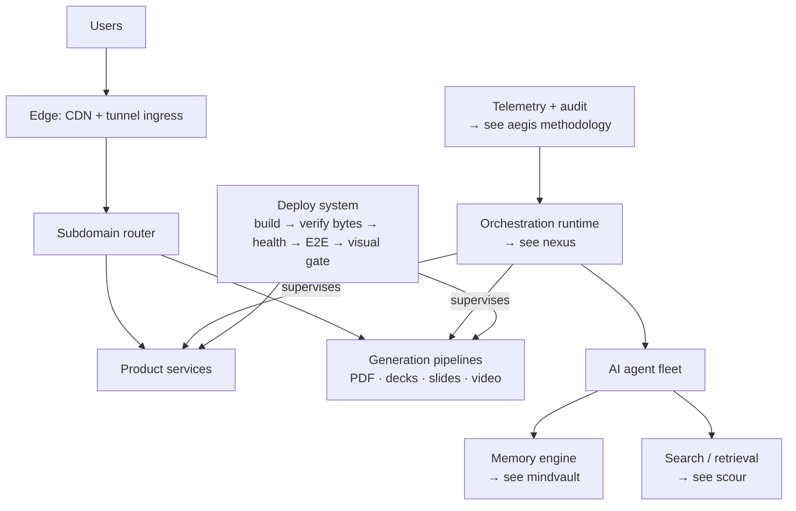

# The Estate

A production software estate — search engines, evaluation tooling, multi-agent runtimes, and the infrastructure that runs them — built and operated end to end by one engineer.

Everything below is deployed, monitored, and serving real users right now. Case studies, live demos, and engagement details live at **[ark.chakrakali.com](https://ark.chakrakali.com)**.

## By the numbers

| Metric | Value | How it's kept honest |
|---|---|---|
| Production services | **120+** | live estate inventory, refreshed every 6h |
| Fleet liveness | **evidence-based** | health asserted by real checks + streamed to an ops cockpit — never timeout guesswork |
| Stall recovery | **automatic** | supervised recovery on failure, no human in the loop |
| AI memory store | **180,000+ memories** | 100% embedding coverage, 60K+ knowledge-graph edges, 1024-dim |
| Frontend quality gate | **Lighthouse 100** | deploys are blocked below it — a ratchet, not a goal |

Every number is something a machine already does, every day, in production — not a roadmap. The estate self-heals, self-tests, and refuses to deploy anything that would lower the bar, because that discipline is wired into the pipeline rather than left to whoever's paying attention that day.

## Selected work

| Product | What it does |
|---|---|
| **DocForge** | Pixel-accurate PDF & PowerPoint generation as an API |
| **DeepLens** | Federated search across 40+ sources |
| **Warden** | Smart scheduling with embeddable booking flows |
| **StudyMagic** | AI-driven spaced-repetition learning platform |
| **Isekai Engine** | AI narrative RPG with persistent world state |
| **HTML deck generator** | Animated presentation decks from a prompt |
| **Programmatic video** | Scripted, voiced, rendered video — fan-out cloud rendering |
| **Workflow Master** | AI business-workflow engine |

Full catalog with case studies → [ark.chakrakali.com](https://ark.chakrakali.com)

## How it runs

Agents do the labor, architecture does the discipline. A supervised AI agent fleet handles implementation under hard gates — tests, byte-verified deploys, Lighthouse ratchets, visual verification against production. The interesting engineering is the gates, not the agents.

## Engineering doctrine

- **The diff is the proof.** Claims ship with benchmarks and before/after numbers, or they're marked pending.
- **Debug the root cause.** A workaround just moves the bug somewhere you'll find it later.
- **No silent failures.** Detect → confirm → recover → escalate loudly. Liveness by evidence, never by timeout.
- **Quality is a ratchet.** Gates only tighten. A deploy that would lower the bar doesn't deploy.

## Links

- **Portfolio, case studies, engagement** → [ark.chakrakali.com](https://ark.chakrakali.com)
- **[scour](https://github.com/SA-Ark/scour)** — zero-dependency hybrid search engine for Rust
- **[aegis](https://github.com/SA-Ark/aegis)** — production-readiness audit CLI
- **[crucible](https://github.com/SA-Ark/crucible)** — evaluation harness for LLM & RAG systems
- **[nexus](https://github.com/SA-Ark/nexus)** / **[mindvault](https://github.com/SA-Ark/mindvault)** — multi-agent runtime & memory engine, with live demos
